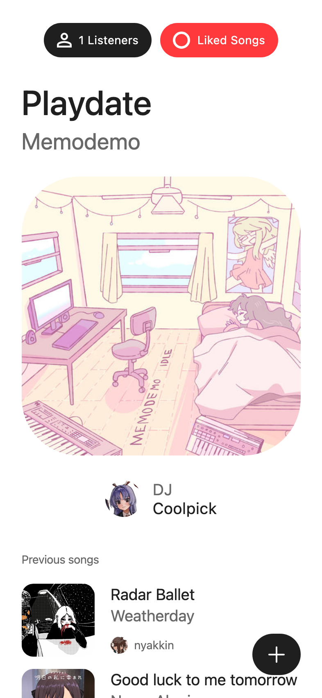

# community.fm

A configurable self-hosted radio station with powerful modes.

|         Desktop         |         Mobile         |
| :---------------------: | :--------------------: |
|  |  |

...and you can also listen on VLC, MPV, IINA, Broadcasts, foobar2000, ffplay, Icecast compatible players, and a Discord bot in VCs.

## Features

- Simple & configurable
- User friendly and clean UI
- Compatible with most media players
- Track crossfades, audio normalization, blank skipping, transitions with jingles
- Discord bot: radio controlling, queuing, VC streaming
- Radio modes:
    - Local Folder
    - Request Queue
    - YouTube Playlist
    - Last.fm Top Tracks
    - Discord Channel of Playlists
    - Incoming Livestream

## Setup

TODO

## FAQ

- Why are track downloads of low accuracy/quality?
- How do I replace the radio webpage?
- How do I create a new radio mode?
- I have a bug to report / feature idea!
