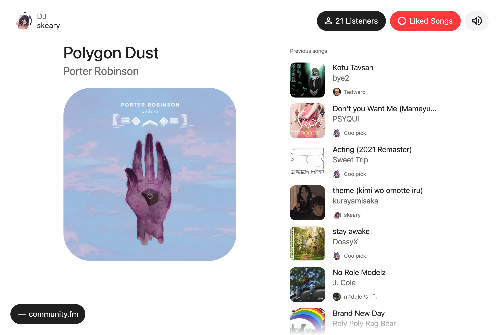

<div align="center">

# community.fm

A configurable self-hosted radio station with powerful modes.


[Installation](#installation) •
[Setup](docs/setup.md) •
[FAQ](docs/faq.md)

</div>

> [!NOTE]
> community.fm does not condone piracy or unauthorized distribution of copyrighted material, and contains no code for bypassing copyright protections or obtaining unauthorized content.



...and you can also listen on [VLC](https://www.videolan.org/), [MPV](https://mpv.io/), [IINA](https://iina.io/), [Broadcasts](https://apps.apple.com/us/app/broadcasts/id1469995354), [foobar2000](https://www.foobar2000.org/), [ffplay](https://ffmpeg.org/ffplay.html), [Icecast compatible players](https://icecast.org/apps/#players), and a Discord bot in VCs.

## Features

- Simple & configurable
- User friendly and clean UI
- Compatible with most media players
- Track crossfades, audio normalization, blank skipping, jingles
- Discord bot with radio controlling, queuing, VC streaming

### Radio Modes

| Mode                                                                       | Description                                                                |
| -------------------------------------------------------------------------- | -------------------------------------------------------------------------- |
| [Local Songs](docs/setup.md#local-songs)                                   | shuffles through a local library of music                                  |
| [Request Queue](docs/setup.md#request-queue)                               | plays manually queued songs/albums/playlists from a URL or search          |
| [YouTube Playlist](docs/setup.md#youtube-playlist)                         | plays songs from a YouTube playlist or a single video                      |
| [Last.fm Top Tracks](docs/setup.md#lastfm-top-tracks)                      | plays from users top scrobbled songs by Last.fm during a given time period |
| [Discord Channel of Playlists](docs/setup.md#discord-channel-of-playlists) | plays songs from a text channel of Spotify/YouTube/Apple Music playlists   |
| [Incoming Livestream](docs/setup.md#incoming-livestream)                   | proxies an incoming livestream to the radio                                |

## Installation

### Step 1 - Download the required files

Create a directory of your choice (e.g. `./community-fm`) to hold the `docker-compose.yml`, `.env`, and `modes.toml` files.

```bash
mkdir ./community-fm && cd ./community-fm
```

Download `docker-compose.yml`, `example.env`, and `modes.toml.example` by running the following commands:

```bash
curl -o docker-compose.yml https://raw.githubusercontent.com/skearya/community.fm/refs/heads/main/docker-compose.yml
curl -o .env https://raw.githubusercontent.com/skearya/community.fm/refs/heads/main/.env.example
curl -o modes.toml https://raw.githubusercontent.com/skearya/community.fm/refs/heads/main/modes.toml.example
```

### Step 2 - Edit the `.env` and `modes.toml` files with custom values

Radio modes are enabled in `modes.toml`, [see the full list of supported modes here](). You can enable any combination of modes, including multiple instances of the same mode. Using a mode looks like so:

```toml
[modes.(type)."(name)"]
# options...
```

For example, this creates an instance of the "Local Songs" (`local`) mode named "Hardstyle Tracks".

```toml
[modes.local."Hardstyle Tracks"]
directory = "/music/hardsyle"
```

community.fm needs at least one radio mode active in order to start. The "Local Songs" radio mode has already been enabled in the `modes.toml`, to use it **set `LOCAL_MUSIC_DIRECTORY` in `.env` to a folder on your machine with audio files**.

> If you don't want to enable the "Local Songs" mode, you can remove the two `${LOCAL_MUSIC_DIRECTORY}:/music:ro` bind mounts in the `docker-compose.yml` and enable another mode instead.

> [!CAUTION]
> The `ICECAST_SOURCE_PASSWORD`, `ICECAST_RELAY_PASSWORD`, `ICECAST_ADMIN_PASSWORD`, `LIVE_SOURCE_PASSWORD` variables **must be replaced** from the default of "hackme" on a public instance. You can generate passwords by running `openssl rand -hex 16`.

<details>

<summary><code>.env</code></summary>

```bash
# URL of Icecast instance (ex: http://localhost:8000/ or https://listen.example.com/)
ICECAST_BASE_URL=http://localhost:8000/

# Passwords (MUST BE CHANGED from "hackme" on a public instance)
ICECAST_SOURCE_PASSWORD=hackme
ICECAST_RELAY_PASSWORD=hackme
ICECAST_ADMIN_PASSWORD=hackme
LIVE_SOURCE_PASSWORD=hackme

# Directory of music for 'Local Songs' mode
LOCAL_MUSIC_DIRECTORY=?

# Token for the Discord bot (https://discord.com/developers/applications)
# DISCORD_BOT_TOKEN=?

# Last.fm API account (https://www.last.fm/api/account/create)
# LASTFM_API_KEY=?
# LASTFM_SECRET=?

# Location of 'streamrip/config.toml' (run `rip config path`)
# STREAMRIP_CONFIG_PATH=?
```

</details>

<details>

<summary><code>modes.toml</code></summary>

```toml
[modes.local."Local Songs"]
directory = "/music"

# [modes.queue."Request Queue"]
# autoswitch = true

# [modes.youtube."DJ Mixes"]
# playlist-id = "..."

# [modes.last-fm."Weekly Top Tracks"]
# period = "7day"

# [modes.channel."Liked Songs"]
# channel-name = "liked-songs"
```

</details>

### Step 3 - Start the containers

From the directory you created in Step 1 (which should now contain your customized `.env` and `modes.toml` files), run the following command to start community.fm as a background service:

```bash
docker compose up -d
```

Open up `http://localhost:8000/` in your browser and you should see community.fm playing your music.

[Visit the setup documentation to enable the features and radio modes you want!](docs/setup.md)
